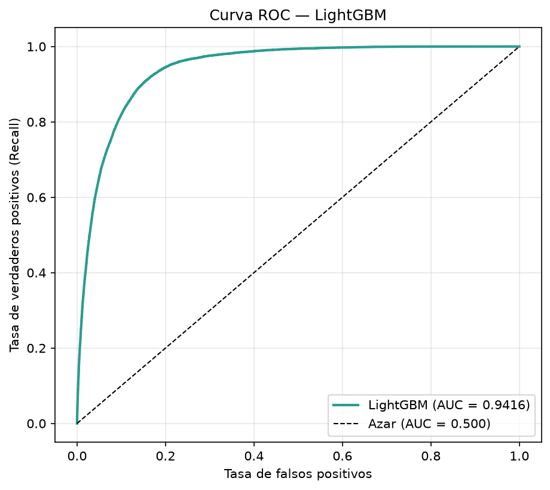
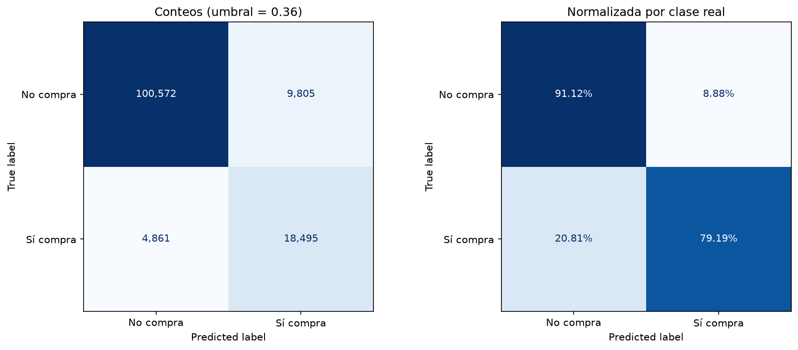
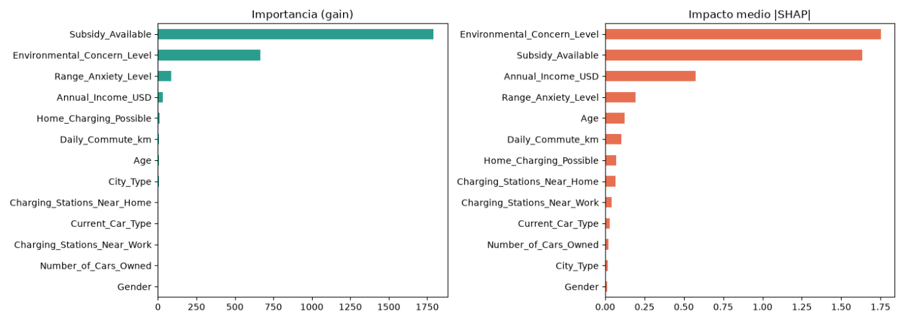
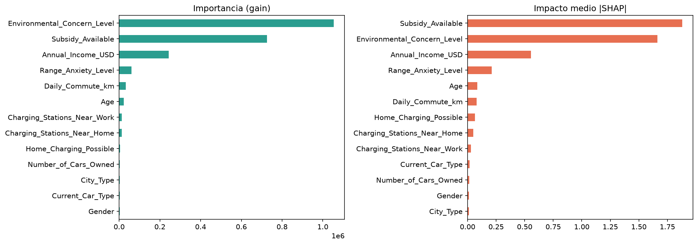

# 🚗⚡ Predicción de Compra de Vehículos Eléctricos

Comparación de dos modelos de *gradient boosting* — **XGBoost** y **LightGBM** — para predecir si una persona comprará un vehículo eléctrico. Desarrollado para la competencia de Kaggle [Predicting Electric Vehicle Purchases](https://www.kaggle.com/competitions/playground-series-s6e9/overview) (Playground Series – Season 6, Episode 9).

---

## 📌 Resultados

| Modelo | AUC-ROC | Mejor iteración | Umbral | Precision | Recall | F1 | Accuracy |
|---|---|---|---|---|---|---|---|
| XGBoost | **0.9417** | 497 | 0.36 | 0.65 | 0.79 | 0.7162 | 0.89 |
| LightGBM | 0.9416 | **375** | 0.36 | 0.65 | 0.79 | 0.7161 | 0.89 |

*Precision, recall y F1 corresponden a la clase minoritaria ("Sí compra"), medidas sobre el mismo conjunto de validación.*

**Empate técnico:** la diferencia de AUC es de 0.0001, pero LightGBM alcanzó ese punto con 122 iteraciones menos.

---

## 📊 Datos

El conjunto de entrenamiento tiene **668 665 registros** y 13 variables predictoras:

- **Numéricas:** `Age`, `Annual_Income_USD`, `Daily_Commute_km`, `Number_of_Cars_Owned`, `Charging_Stations_Near_Home`, `Charging_Stations_Near_Work`, `Environmental_Concern_Level`
- **Categóricas:** `Gender`, `City_Type`, `Current_Car_Type`, `Home_Charging_Possible`, `Subsidy_Available`, `Range_Anxiety_Level`
- **Objetivo:** `Will_Buy_EV` (Yes / No)

### El reto: clases desbalanceadas

Solo el **17.5 %** de las personas compra un vehículo eléctrico. Un modelo que prediga siempre "No" tendría 82 % de accuracy sin aportar nada, por eso la evaluación se centró en **AUC, precision, recall y F1** en lugar de la accuracy.

---

## ⚙️ Metodología

Ambos modelos comparten el mismo procedimiento para que la comparación sea justa:

1. **División estratificada 80/20** con la misma semilla (`random_state=42`).
2. **Variables categóricas nativas**, sin one-hot encoding ni escalado: los árboles dividen por umbrales, así que la escala de las variables no afecta al resultado.
3. **Early stopping** con 100 rondas de paciencia sobre el AUC de validación.
4. **Optimización del umbral de decisión** para maximizar el F1 de la clase minoritaria.
5. **Interpretación** con importancia por *gain* y valores **SHAP**.
6. **Persistencia** del modelo, el umbral y las categorías para predecir sin reentrenar.

### Hiperparámetros

**XGBoost**

```python
XGBClassifier(
    n_estimators=3000,
    learning_rate=0.05,
    max_depth=6,
    min_child_weight=5,
    subsample=0.8,
    colsample_bytree=0.8,
    reg_lambda=1.0,
    tree_method='hist',
    enable_categorical=True,
    eval_metric='auc',
    early_stopping_rounds=100,
)
```

**LightGBM**

```python
LGBMClassifier(
    n_estimators=3000,
    learning_rate=0.05,
    num_leaves=63,
    min_child_samples=50,
    subsample=0.8,
    subsample_freq=1,
    colsample_bytree=0.8,
    reg_lambda=1.0,
    n_jobs=-1,
    random_state=42,
)
```

> ⚠️ En LightGBM, `subsample` se ignora en silencio si no se define también `subsample_freq`. No lanza ningún error: simplemente no se aplica.

---

## 🎯 Ajuste del umbral

Por defecto un clasificador predice "Yes" cuando la probabilidad supera **0.5**. Con clases desbalanceadas, ese corte deja escapar a muchos compradores reales.

Se evaluaron umbrales entre 0.10 y 0.90 y, en ambos modelos, el que maximizó el F1 fue **0.36**:

| Clase | Precision | Recall | F1 | Soporte |
|---|---|---|---|---|
| No compra (0) | 0.95 | 0.91 | 0.93 | 110 377 |
| Sí compra (1) | 0.65 | 0.79 | 0.72 | 23 356 |

Con este umbral el modelo **detecta 8 de cada 10 compradores reales**, a cambio de que aproximadamente 1 de cada 3 personas marcadas como compradoras no lo sea. En un caso de marketing es un intercambio favorable: cuesta menos contactar a un cliente que no compra que perder a uno que sí lo haría.

### Curva ROC — LightGBM



### Matriz de confusión — LightGBM



La matriz normalizada por clase real es la más informativa: la fila inferior muestra qué porcentaje de compradores reales detecta el modelo (recall) y cuántos se escapan.

---

## 🔍 ¿Qué variables influyen más?

**XGBoost**



**LightGBM**



Las dos medidas responden preguntas distintas:

- **Gain:** cuánto mejora el modelo cada vez que usa una variable para dividir.
- **SHAP:** cuánto mueve esa variable la predicción de cada persona en particular.

Por eso el orden de los dos primeros puestos se intercambia entre una medida y otra, y entre un modelo y otro. Lo relevante es que **ambos algoritmos, con ambas métricas, señalan el mismo par de variables en la cima**: `Environmental_Concern_Level` y `Subsidy_Available`, seguidas de `Annual_Income_USD`.

Esa coincidencia es un buen indicio de que el patrón está en los datos y no es un artefacto de un algoritmo concreto: **la motivación ambiental y el incentivo económico deciden la compra**. En cambio, las estaciones de carga cercanas, la cantidad de autos y el género apenas influyen.

---

## 📁 Estructura del proyecto

```
├── datos/                      # train.csv y test.csv (descargar desde Kaggle)
├── modelo/
│   ├── modelo_xgb.json         # XGBoost entrenado
│   ├── config_modelo.json      # umbral, categorías y columnas (XGBoost)
│   ├── modelo_lgbm.pkl         # LightGBM entrenado
│   └── config_lgbm.json        # umbral, categorías y columnas (LightGBM)
├── imagenes/
│   ├── importancia_variables.png
│   ├── importancia_lgbm.png
│   ├── curva_roc_lgbm.png
│   └── matriz_confusion_lgbm.png
├── predicciones/               # archivos de submission
├── XGBOOST.ipynb               # modelo 1
├── LGB.ipynb                   # modelo 2
└── README.md
```

---

## ▶️ Cómo ejecutarlo

1. Clona el repositorio:
   ```bash
   git clone https://github.com/KREMC/Kaggle-Predicting-Electric-Vehicle-Purchases.git
   ```
2. Descarga `train.csv` y `test.csv` desde la [página de la competencia](https://www.kaggle.com/competitions/playground-series-s6e9/data) y colócalos en `datos/`.
3. Instala las dependencias:
   ```bash
   pip install pandas numpy scikit-learn xgboost lightgbm matplotlib joblib
   ```
4. Ejecuta `XGBOOST.ipynb` y `LGB.ipynb`.

---

## 🛠️ Tecnologías

Python · Pandas · NumPy · Scikit-learn · XGBoost · LightGBM · Matplotlib · Jupyter

---

## 👤 Autor

**Royer Elvis Moreano Condorcuya**
Ingeniero de Sistemas e Informática · Machine Learning / Data Science

[GitHub](https://github.com/KREMC) · [LinkedIn](https://www.linkedin.com/in/TU-PERFIL)